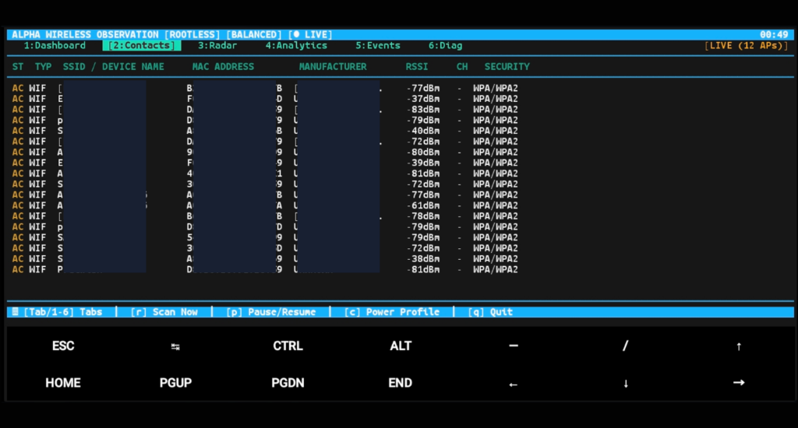

# ALPHA

## Termux-Native Rootless Wireless Observation & Environmental Awareness Platform

---

<div align="center">
  
  <p><em>Alpha rootless wireless observation TUI running in Termux on Android with live contact tracking & RSSI telemetry.</em></p>
</div>

---

## 1. Overview

**Alpha** is an open-source, rootless wireless observation and environmental awareness platform built natively for Android/Termux environments. Operating with capability honesty, Alpha uses the legitimate APIs exposed by Android and Termux without requiring root, custom kernels, or modified firmware.

Its processing pipeline follows the strict progression:

> **Observe → Normalize → Correlate → Classify → Track → Analyze → Visualize → Alert → Export**

---

## 2. Core Capabilities

* **Wi-Fi Environmental Observation:** Integrates with Termux:API (`termux-wifi-scaninfo`) to capture SSIDs, BSSIDs, signal levels (RSSI), operating frequencies, derived channels, and 802.11 security capabilities.
* **Scan Throttling & Freshness Tracking:** Identifies whether scan results from Android are live, cached, or throttled based on microsecond timestamp delta analysis.
* **Honest BLE Capability Probing:** Gracefully detects whether BLE advertisement scanning is exposed in the user's Termux environment, reporting status accurately without crashing.
* **Local-First IEEE OUI Identification:** Embedded offline vendor database with over 35,000 IEEE prefixes (MA-L, MA-M, MA-S), plus automatic detection of Locally Administered / Randomized MAC addresses (IEEE 802 U/L bit).
* **Temporal Contact Tracking:** Maintains distinct entities (`NEW`, `ACTIVE`, `RECENT`, `STALE`) with rolling RSSI statistics (min, max, mean, variance, trend).
* **Heuristic Device Classification:** Transparent rule-based inference assigning functional categories (`ROUTER`, `MOBILE_DEVICE`, `ACCESS_POINT`, `IOT`, `WEARABLE`, `COMPUTER`, `NETWORK_INFRASTRUCTURE`, `PERIPHERAL`) with confidence scores and evidence logs.
* **Relative Signal Radar:** Deterministic polar visualization mapping contacts by identifier hash (stable angle) and RSSI signal proximity (radius).
* **Environmental Baselines & Change Detection:** Establishes RF population profiles and triggers alerts on significant environmental shifts.
* **Watchlist & Alerts:** Configurable target matching triggering non-blocking alerts (Terminal beep, `termux-notification`, `termux-vibrate`).
* **Multi-Format Exports & Debrief:** Exports sessions to CSV, JSON, Markdown, and comprehensive LLM-ready debrief reports.
* **Realistic Mock Mode:** 5 rich development scenarios (`normal`, `busy`, `changing`, `sparse`, `unknown`).

---

## 3. Installation

### 3.1 Termux Quickstart

In Termux on Android:

```bash
# 1. Clone repository
git clone https://github.com/example/alpha.git
cd alpha

# 2. Run rootless installer
chmod +x install.sh
./install.sh

# 3. Launch Alpha
alpha
```

### 3.2 Manual / Development Installation

```bash
python -m pip install -e .
python -m alpha.cli --self-test
```

---

## 4. CLI Usage & Commands

```bash
# Launch interactive full-screen TUI monitor
alpha

# Perform a single one-shot scan and print formatted table
alpha scan

# Run single scan with JSON output
alpha scan --json

# View discovered wireless devices
alpha devices
alpha devices --active
alpha devices --wifi

# Display relative signal radar in terminal
alpha radar

# Show RF spectrum, channel occupancy, and vendor analytics
alpha analytics

# View recorded environmental events
alpha events

# View temporal observation rate timeline
alpha timeline

# Manage sessions
alpha session list
alpha session show <session_id>

# Run environmental baseline comparison
alpha baseline start
alpha baseline status

# Manage watchlist rules
alpha watchlist list
alpha watchlist add --type SSID --pattern "SecretNet" --label "Target AP"
alpha watchlist remove --id wl_123

# Export session data
alpha export --csv -o contacts.csv
alpha export --json -o session.json
alpha export --markdown -o report.md
alpha export --debrief -o debrief.md

# Inspect environment diagnostics and capability matrix
alpha diagnostics
alpha capabilities
alpha capabilities --json

# Run built-in self-test suite
alpha --self-test

# Run in mock/simulation mode
alpha --mock --scenario busy
```

---

## 5. Interactive TUI Keybindings

When running `alpha` or `alpha monitor`:

| Key | Action |
| :--- | :--- |
| `[Tab]` / `[1-6]` | Switch between Views (Dashboard, Contacts, Radar, Analytics, Events, Diagnostics) |
| `[q]` | Cleanly exit monitoring, flush database, and restore terminal state |
| `[p]` | Pause / Resume live scanning |
| `[r]` | Force an immediate wireless scan pass |
| `[c]` | Cycle Power Profile (`BALANCED` → `ACTIVE` → `LOW_POWER`) |
| `[/]` | Filter contacts by SSID, MAC, or Vendor |

---

## 6. Architecture & Data Provenance

```text
Acquisition (Termux Wi-Fi / BLE / Mock)
       ↓
Normalization & ANSI Sanitization
       ↓
Temporal Correlation (NEW / ACTIVE / RECENT / STALE)
       ↓
Local OUI Lookup & Randomized MAC Detection
       ↓
Heuristic Classifier & Signature Matching
       ↓
Environmental Baselines & Anomaly Detection
       ↓
Watchlist & Event Engine
       ↓
SQLite Storage (WAL Mode, Parameterized)
       ↓
Presentation (Responsive TUI, Radar, Analytics, Alerts, Exports)
```

### Data Provenance Classes
* **OBSERVED:** Directly acquired from Android/Termux APIs (SSID, BSSID, RSSI, Frequency, Capabilities).
* **DERIVED:** Statistically calculated from observations (Channel number, Frequency Band, Rolling Mean RSSI, Contact State, Timelines).
* **HEURISTIC:** Inferred from evidence rules (Device Category, Confidence Score, Signature Matches, Environmental Anomalies).

---

## 7. Security Scope & Boundaries

Alpha is strictly a **passive observation and defensive environmental awareness tool**.

* **Rootless by Design:** Operates within standard Android user permissions.
* **No Attack Tools:** Does not implement deauthentication, packet injection, rogue APs, evil twins, or brute-force cracking.
* **Terminal Safety:** Strips ANSI escape sequences and non-printable control characters from all untrusted SSIDs and broadcast names to prevent cursor hijacking or screen spoofing.
* **Local-First Privacy:** Operates 100% offline. Zero cloud services, telemetry, or remote analytics.

---

## 8. License

MIT License. Open source and community maintained.
